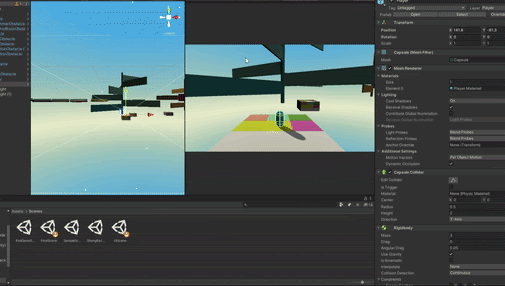
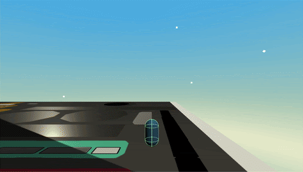
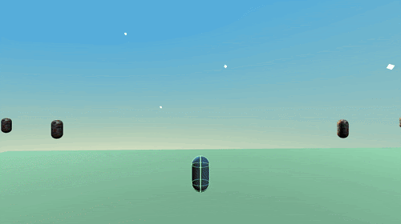
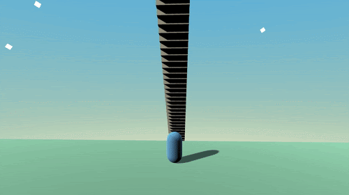

# 
 **Capsule's Adventure** 

## <a href= "https://play.unity.com/mg/other/newbuild-4"> **PLAY GAME** </a>
## **Description**

 Capsule’s Adventure is a platform game in which the players have to pass various obstacles to win the game. This game requires players to spend some time and effort, its difficulty is considered high by the designers. So, feel free to challenge and prove us wrong. 

## **How To Play**
* **WASD** to control the Capsule's movement
* **Mouse Movement** to control the camera facing
* **Mouse Scroll** to zoom in and out
* **Left Mouse Click** to slow down gravity acceleration
* **Right Mouse Click** to accelerate gravity
* **Shift** to accelerate the Capsule’s forward movement
* **Space** to jump ( double jump allowed )

## **Gameplay**

**Checkpoint 1**

 

    *Tip: Avoid traps*

**Checkpoint 2**

 

    *Tip: Adjust your camera angle to pass*

**Checkpoint 3**

 

    *Tip: Yin & Yang planes are rotating*

**CheckPoint 4**

 

**CheckPoint 5**

 

**CheckPoint 6**

 

    *Tip: Avoid traps*

**CheckPoint 7**

 

    *Tip: Find another path other than going straight up*

**CheckPoint 8**

 

**CheckPoint 9**

 

    *Tip: Find the path to avoid all enemies*

**CheckPoint 10**

 

## **Built With**
* Unity
* C#

## **Deployment**
* Hosted on Unity Connect
* Check it out: https://play.unity.com/mg/other/newbuild-4

## **Contributors**
### Github:
* Sheng Da Chen: https://www.linkedin.com/in/sheng-chen-684014202/
* Jie Zhang: https://www.linkedin.com/in/jie-zhang-54a2b2160/
* Yanhui Chen: https://www.linkedin.com/in/yanhui-chen-b75660203/

### LinkedIn:
* Sheng Da Chen: https://github.com/asd908433289
* Jie Zhang: https://github.com/Jie-Zhang-2001
* Yanhui Chen: https://github.com/YanhuiChen1

